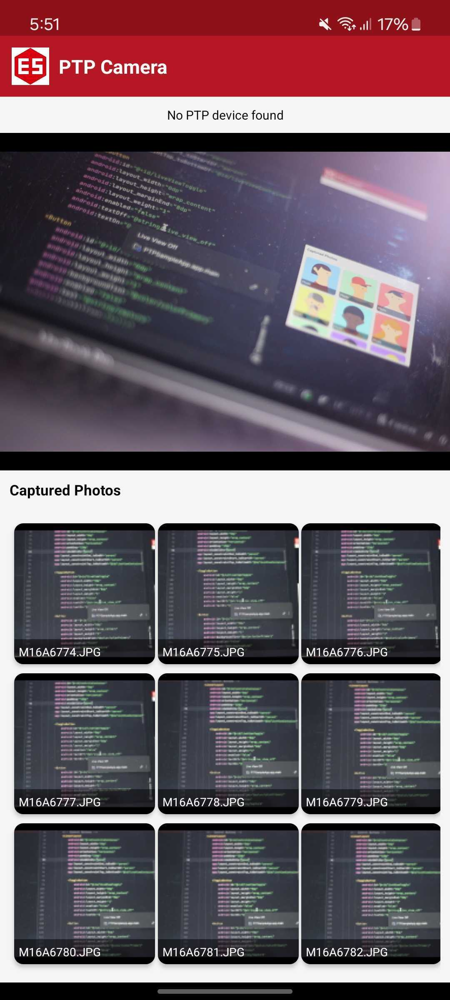

[](https://jitpack.io/#/ReemMousaES/es-ptp-camera)
# ES PTP Camera

Android library for communicating with digital cameras via USB using the Picture Transfer Protocol (PTP).

## Features

- **Canon EOS Support**: Remote control, live view streaming, capture, bulb mode
- **Nikon Camera Support**: Remote control, live view, capture, focus, settings
- **USB Host API**: Direct USB communication with cameras
- **Live View Streaming**: Real-time preview from supported cameras with double-buffering for smooth playback
- **Camera Settings**: Control ISO, aperture, shutter speed, white balance, and more
- **Image Retrieval**: Automatic thumbnail and full image retrieval after capture

## Sample App

A complete sample app demonstrating all features is available in the [ptp-sample-app](https://github.com/ReemMousaES/ptp-sample-app) repository.

<div align="center">

| Screenshot | Demo |
|:----------:|:----:|
|  |  |

</div>

## Installation

Add JitPack repository to your project's `settings.gradle.kts`:

```kotlin
dependencyResolutionManagement {
    repositories {
        google()
        mavenCentral()
        maven { url = uri("https://jitpack.io") }
    }
}
```

Add dependency to your app's `build.gradle.kts`:

```kotlin
implementation("com.github.ReemMousaES:es-ptp-camera:v1.0.3")
```

## Usage

### 1. Add USB Permission to AndroidManifest.xml

```xml
<uses-feature android:name="android.hardware.usb.host" android:required="true" />
```

### 2. Initialize PTP Service

```kotlin
import com.extremesolution.esptpcamera.PtpService
import com.extremesolution.esptpcamera.Camera
import com.extremesolution.esptpcamera.EosCamera

private var ptpService: PtpService? = null
private var connectedCamera: Camera? = null

ptpService = PtpService.Singleton.getInstance(context)
ptpService?.setCameraListener(object : Camera.CameraListener {
    override fun onCameraStarted(camera: Camera) {
        connectedCamera = camera
        // Camera connected and ready
    }

    override fun onCameraStopped(camera: Camera) {
        connectedCamera = null
        // Camera disconnected
    }

    override fun onError(message: String) {
        // Handle error
    }

    override fun onObjectAdded(handle: Int, format: Int) {
        // New image added - retrieve it
        camera.retrieveImageInfo(listener, handle)
    }
    
    // ... other callbacks
})
```

### 3. Request USB Permission

```kotlin
val usbManager = context.getSystemService(Context.USB_SERVICE) as UsbManager
val permissionIntent = PendingIntent.getBroadcast(
    context, 0, 
    Intent(ACTION_USB_PERMISSION), 
    PendingIntent.FLAG_IMMUTABLE
)

// Find and request permission for PTP camera device
usbManager.deviceList.values.find { /* check for PTP interface */ }?.let { device ->
    usbManager.requestPermission(device, permissionIntent)
}
```

### 4. Start PTP Service After Permission Granted

```kotlin
ptpService?.initialize(context, intent, true)
```

### 5. Live View (Canon EOS)

```kotlin
val camera = connectedCamera as? EosCamera ?: return

// Start live view
camera.setLiveView(true)

// Request live view frames with double-buffering for smooth playback
private var currentLiveViewData: LiveViewData? = null
private var previousLiveViewData: LiveViewData? = null

override fun onLiveViewStarted() {
    currentLiveViewData = null
    previousLiveViewData = null
    camera.getLiveViewPicture(null) // Start polling
}

override fun onLiveViewData(data: LiveViewData?) {
    if (!isLiveViewActive) return
    
    if (data == null) {
        camera.getLiveViewPicture(previousLiveViewData)
        return
    }
    
    // Display the frame
    data.bitmap?.let { imageView.setImageBitmap(it) }
    
    // Swap buffers and request next frame
    previousLiveViewData = currentLiveViewData
    currentLiveViewData = data
    camera.getLiveViewPicture(previousLiveViewData)
}

// Stop live view
camera.setLiveView(false)
```

### 6. Capture Photo

```kotlin
camera.capture()
```

### 7. Retrieve Captured Image

```kotlin
override fun onObjectAdded(handle: Int, format: Int) {
    // Retrieve thumbnail first
    camera.retrieveImageInfo(object : Camera.RetrieveImageInfoListener {
        override fun onImageInfoRetrieved(
            objectHandle: Int,
            objectInfo: ObjectInfo?,
            thumbnail: Bitmap?
        ) {
            // Display thumbnail
            thumbnail?.let { showThumbnail(it) }
            
            // Optionally retrieve full image
            camera.retrieveImage(object : Camera.RetrieveImageListener {
                override fun onImageRetrieved(
                    objHandle: Int,
                    image: Bitmap?,
                    orientation: Int
                ) {
                    // Display full image
                    image?.let { showFullImage(it) }
                }
            }, objectHandle)
        }
    }, handle)
}
```

### 8. Handle Camera Properties

```kotlin
override fun onPropertyChanged(property: Int, value: Int) {
    when (property) {
        Camera.Property.IsoSpeed -> // Handle ISO change
        Camera.Property.FNumber -> // Handle aperture change
        Camera.Property.ShutterSpeed -> // Handle shutter speed change
    }
}

override fun onPropertyDescChanged(property: Int, values: IntArray) {
    // Available values for property changed
}
```

## Requirements

- Min SDK: 24 (Android 7.0)
- Target SDK: 35
- Android device with USB Host support
- USB OTG cable for connecting camera

## Supported Cameras

### Canon EOS
- EOS R Series (R5, R6, R6 Mark II, etc.)
- EOS 5D Series
- EOS 6D Series
- EOS 7D Series
- EOS 80D, 90D
- And more...

### Nikon
- D Series (D850, D750, D500, etc.)
- Z Series (Z6, Z7, Z6II, Z7II, etc.)

## Troubleshooting

### Camera not detected
- Ensure USB OTG cable is properly connected
- Check that your Android device supports USB Host mode
- Try reconnecting the USB cable

### Live view not working
- Make sure camera is in photo mode (not video or playback)
- Check if live view is enabled on camera LCD
- Wait a few seconds after connecting before starting live view

### Capture not working
- Ensure camera is not in playback mode
- Check if memory card is inserted
- Verify camera is not busy with other operations

## Attribution

This library is a fork of the original [RemoteYourCam USB](https://github.com/michaelzoech/remoteyourcam-usb) project by:

- Nils Assbeck
- Guersel Ayaz
- Michael Zoech

Licensed under Apache License 2.0.

## License

```
Copyright 2013 Nils Assbeck, Guersel Ayaz and Michael Zoech
Copyright 2024 ExtremeSolution

Licensed under the Apache License, Version 2.0 (the "License");
you may not use this file except in compliance with the License.
You may obtain a copy of the License at

http://www.apache.org/licenses/LICENSE-2.0

Unless required by applicable law or agreed to in writing, software
distributed under the License is distributed on an "AS IS" BASIS,
WITHOUT WARRANTIES OR CONDITIONS OF ANY KIND, either express or implied.
See the License for the specific language governing permissions and
limitations under the License.
```

See [LICENSE](LICENSE) for full license text.

Developed by [Extreme Solution](https://extremesolution.com) - Your Digital Transformation Partner
